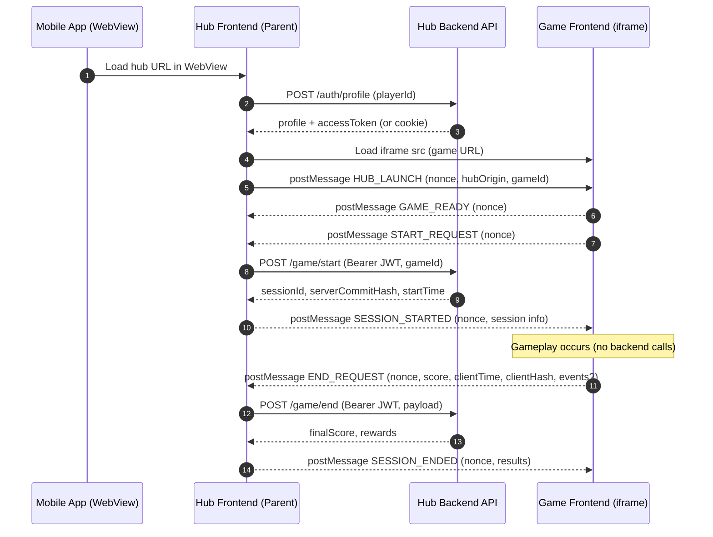

# Game-side Spec – Mini Game Hub iframe Integration

Audience: **Game frontend developers** (no backend).  
Runtime: Game runs inside an **iframe** embedded by the Mini Game Hub (parent).  
Communication: **postMessage** only. The game **must not** call the hub backend APIs directly.

---

## 1) Goals

- Allow the hub (parent) to:
  - start a game session on the hub backend
  - end a game session on the hub backend
- Ensure the game (iframe) never receives sensitive credentials (JWT).
- Provide a deterministic and testable message contract for start/end.

---

## 2) Trust & Security Model

### What the game can trust
- The hub will send an initialization message (`HUB_LAUNCH`) containing:
  - `hubOrigin` (the target origin to post messages to)
  - `nonce` (per-launch random value)

### What the hub will enforce
- Hub validates `event.origin` against the configured `gameOrigin`.
- Hub requires the correct `nonce` on every message.

### What you (game) must do
- Only post messages to the provided `hubOrigin` (avoid `"*"` in production).
- Include `nonce` with every message to the hub.
- Do not include secrets in messages. Assume messages can be observed on compromised devices.

---

## 3) Message Protocol (Game → Hub)

All outgoing messages **MUST** include `nonce`.

### 3.1 GAME_READY
Send when the game is fully loaded and ready to begin.

```json
{ "type": "GAME_READY", "nonce": "<nonce>" }
```

### 3.2 START_REQUEST
Send when the player actually starts gameplay (not merely when the page loads).

```json
{ "type": "START_REQUEST", "nonce": "<nonce>" }
```

### 3.3 END_REQUEST
Send exactly once when the session ends (finish, fail, quit).

```json
{
  "type": "END_REQUEST",
  "nonce": "<nonce>",
  "score": 200,
  "clientTime": 1500,
  "clientHash": "hash",
  "events": [
    { "t": 123, "action": "checkpoint", "metadata": { "id": 1 } }
  ]
}
```

**Field rules**
- `score` (number): final score; use integers if possible.
- `clientTime` (number): elapsed time (ms) for the run/match.
- `clientHash` (string): optional integrity value (implementation defined).
- `events` (optional array): telemetry for validation/analytics.

---

## 4) Message Protocol (Hub → Game)

Incoming messages from hub will include the same `nonce`. Always validate the `nonce` matches your stored value.

### 4.1 HUB_LAUNCH (required)
Initialization handshake message from hub.

```json
{
  "type": "HUB_LAUNCH",
  "nonce": "<nonce>",
  "hubOrigin": "https://hub.example.com",
  "gameId": "coin-runner-v1"
}
```

**Game requirements**
- Store `nonce` and `hubOrigin`.
- Reply with `GAME_READY` immediately after storing values.

### 4.2 SESSION_STARTED
Hub successfully started the backend session.

```json
{
  "type": "SESSION_STARTED",
  "nonce": "<nonce>",
  "sessionId": "session_8f92ab01",
  "serverCommitHash": "abc...",
  "startTime": "2026-02-03T10:00:00Z"
}
```

**Game note:** `sessionId` is for display/telemetry only. The hub remains authoritative.

### 4.3 SESSION_ENDED
Hub successfully ended the backend session and returns final results.

```json
{
  "type": "SESSION_ENDED",
  "nonce": "<nonce>",
  "finalScore": 200,
  "rewards": { "stars": 1, "coins": 10, "experience": 25 }
}
```

### 4.4 ERROR
Hub rejected the request or backend returned an error.

```json
{
  "type": "ERROR",
  "nonce": "<nonce>",
  "code": "HUB_SESSION_ERROR",
  "message": "..."
}
```

---

## 5) Game Implementation – Reference JavaScript

> Copy/paste and adapt. This is framework-agnostic (works for WebGL/canvas/HTML5).

```js
// ===============================
// Game iframe integration snippet
// ===============================

let HUB_ORIGIN = null; // e.g. "https://hub.example.com"
let NONCE = null;
let SESSION_ID = null;

// Receive messages from the Hub (parent)
window.addEventListener("message", (event) => {
  const msg = event.data;
  if (!msg || typeof msg.type !== "string") return;

  switch (msg.type) {
    case "HUB_LAUNCH": {
      // Prefer hubOrigin provided by hub; fallback to event.origin
      HUB_ORIGIN = msg.hubOrigin || event.origin;
      NONCE = msg.nonce;

      // Reply readiness immediately
      window.parent.postMessage({ type: "GAME_READY", nonce: NONCE }, HUB_ORIGIN);
      break;
    }

    case "SESSION_STARTED": {
      if (msg.nonce !== NONCE) return;
      SESSION_ID = msg.sessionId;
      // TODO: update UI if needed
      break;
    }

    case "SESSION_ENDED": {
      if (msg.nonce !== NONCE) return;
      // TODO: show results UI
      SESSION_ID = null;
      break;
    }

    case "ERROR": {
      // If nonce is present, validate it
      if (msg.nonce && NONCE && msg.nonce !== NONCE) return;
      console.error("Hub error:", msg.code, msg.message);
      // TODO: show an error dialog to player
      break;
    }
  }
});

// Call when gameplay begins (e.g., after countdown)
export function requestStartSession() {
  if (!HUB_ORIGIN || !NONCE) return;
  window.parent.postMessage({ type: "START_REQUEST", nonce: NONCE }, HUB_ORIGIN);
}

// Call when gameplay ends (finish/fail/quit)
export function requestEndSession({ score, clientTimeMs, clientHash, events }) {
  if (!HUB_ORIGIN || !NONCE) return;

  window.parent.postMessage(
    {
      type: "END_REQUEST",
      nonce: NONCE,
      score: Number(score),
      clientTime: Number(clientTimeMs),
      clientHash: String(clientHash || ""),
      events: Array.isArray(events) ? events : undefined,
    },
    HUB_ORIGIN
  );
}
```

---

## 6) Audio & Autoplay Guidance (WebView-safe)

Most mobile WebViews block autoplay audio. Implement these rules:

- Create/resume audio only after a **user gesture** (tap/click).
- If using WebAudio:
  - call `audioContext.resume()` inside a tap handler.
- If audio fails:
  - show a **“Tap to enable sound”** overlay.
- On app background/foreground:
  - expect audio context to suspend; resume on next user gesture.

---

## 7) Debug Checklist

- No handshake:
  - Confirm hub sends `HUB_LAUNCH` and iframe loads successfully.
- Hub ignores messages:
  - Ensure you post to `HUB_ORIGIN` and include `nonce`.
- END rejected:
  - Ensure START was requested and completed first.
- Audio not working:
  - Add “tap to enable sound” and resume audio context in that handler.

---

## 8) Mermaid Sequence Diagram



---

## 9) Acceptance Criteria (Game-side)

- Game loads in iframe without requiring backend connectivity.
- Game responds to `HUB_LAUNCH` and sends `GAME_READY`.
- Game sends `START_REQUEST` only when gameplay begins.
- Game sends `END_REQUEST` exactly once per session.
- Game can handle `ERROR` responses gracefully.
